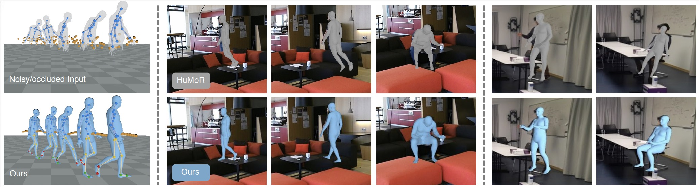

# RoHM
## Robust Human Motion Reconstruction via Diffusion
#### [Project Page](https://sanweiliti.github.io/ROHM/ROHM.html) | [Paper](https://arxiv.org/abs/2401.08570) 


RoHM is a novel diffusion-based motion model that, conditioned on **noisy and occluded input** data, reconstructs complete, plausible motions in **consistent global coordinates**.
-- we **decompose it into two sub-tasks** and learn two models, one for global trajectory and one for local motion. 
To capture the correlations between the two, we then introduce **a novel conditioning module**, combining it with an iterative inference scheme.





## Installation
Creating a clean conda environment and install all dependencies by:
```
conda env create -f environment.yml
```
After the installation is complete, activate the conda environment by:
```
conda activate rohm
```

## Data preparation
### AMASS
* Download the SMPL-X neutral annotations from [AMASS dataset](https://amass.is.tue.mpg.de/index.html), and unzip the files.
* To preprocess the raw AMASS data into the format for RoHM, run the following script for each subset, where ```dataset_name``` indicates the name of each subset. 
It will save the processed AMASS data to ```datasets/AMASS_smplx_preprocessed```.
```
python preprocessing_amass.py --dataset_name=SUBSET_NAME --amass_root=PATH/TO/AMASS --save_root=datasets/AMASS_smplx_preprocessed
```

### PROX
Download the following contents for PROX dataset:
* ```cam2world```, ```calibration``` and ```recordings``` from official [PROX dataset](https://prox.is.tue.mpg.de/)
* ```keypoints_openpose``` and ```mask_joint``` from [here](https://drive.google.com/file/d/1NY22JwWsyaGudhWnWYnVgeIYQtlZyZWQ/view?usp=sharing)
* and organize the contents as below:
```
PROX
├── cam2world
├── calibration
├── recordings
├── keypoints_openpose
├── mask_joint
```

### EgoBody
Download the following contents for EgoBody dataset:
* ```kinect_color```, ```data_splits.csv```, ```calibrations```, ```kinect_cam_params```, ```smplx_camera_wearer_*```, ```smplx_interactee_*``` from the official [EgoBody dataset](https://sanweiliti.github.io/egobody/egobody.html)
* ```keypoints_cleaned```, ```mask_joint``` and ```egobody_rohm_info.csv``` from [here](https://drive.google.com/file/d/1NMw_D_Y7-skEQZHeb27V7AcTb6HBOx1T/view?usp=sharing)
* and organize the contents as below:
```
EgoBody
├── kinect_color
├── data_splits.csv
├── smplx_camera_wearer_train
├── smplx_camera_wearer_test
├── smplx_camera_wearer_val
├── smplx_interactee_train
├── smplx_interactee_test
├── smplx_interactee_val
├── calibrations
├── kinect_cam_params
├── keypoints_cleaned
├── mask_joint
├── egobody_rohm_info.csv
```
`egobody_rohm_info.csv` includes information of recordings from EgoBody that we used for evaluation of RoHM.


### SMPL-X body model
Download SMPL-X body model from [here](https://smpl-x.is.tue.mpg.de/index.html).
Note that the latest version is 1.1 while we use 1.0 in the implementation. 

Download smplx vertices segmentation `smplx_vert_segmentation.json` from [here](https://meshcapade.wiki/assets/SMPL_body_segmentation/smplx/smplx_vert_segmentation.json).

### Other data (checkpoints, input noise for evaluation, etc.)
Download the model checkpoints from [here](https://github.com/sanweiliti/RoHM/releases/tag/v0) and unzip.
Download `eval_noise_smplx` (pre-computed motion noise for evaluation on AMASS) from [here](https://drive.google.com/file/d/18aAWO-57ZQDxd3gw3avuy1gdj-tWUDxj/view?usp=sharing) and unzip.


### Organize all downloaded data as below:
```
RoHM
├── data
│   ├── body_models
│   │   ├── smplx_model
│   │   │   ├── smplx
│   ├── checkpoints
│   ├── eval_noise_smplx
│   ├── smplx_vert_segmentation.json
├── datasets
│   ├── AMASS_smplx_preprocessed
│   ├── PROX
│   ├── EgoBody
```

## Training
RoHM is trained on AMASS dataset.

### TrajNet Training
Train the vanilla TrajNet with a curriculum training scheme for three stages, with increasing noise ratios:
```
python train_trajnet.py --config=cfg_files/train_cfg/trajnet_train_vanilla_stage1.yaml 
python train_trajnet.py --config=cfg_files/train_cfg/trajnet_train_vanilla_stage2.yaml --pretrained_model_path=PATH/TO/MODEL
python train_trajnet.py --config=cfg_files/train_cfg/trajnet_train_vanilla_stage3.yaml --pretrained_model_path=PATH/TO/MODEL
```
For stage 2 and 3, set `pretrained_model_path` to the trained checkpoint from the previous stage.
To obtain the reported checkpoint, we train for 800k/400k/450k steps for stage 1/2/3, respectively.


### TrajNet fine-tuning with TrajControl:
```
python train_trajnet.py --config=cfg_files/train_cfg/trajnet_ft_trajcontrol.yaml --pretrained_backbone_path=PATH/TO/MODEL
```
Set ```pretrained_backbone_path``` to the pre-trained checkpoint of vanilla TrajNet, and we train for 400k to obtain the reported checkpoint.


### PoseNet training
Train PoseNet with a curriculum training scheme for two stages, with increasing noise ratios:
```
python train_posenet.py --config=cfg_files/train_cfg/posenet_train_stage1.yaml
python train_posenet.py --config=cfg_files/train_cfg/posenet_train_stage2.yaml --pretrained_model_path=PATH/TO/MODEL
```
For stage 2, set `pretrained_model_path` to the trained checkpoint from the previous stage.
To obtain the reported checkpoint, we train for 300k/200k steps for stage 1/2, respectively.


## Test and evaluate on AMASS
### Test on AMASS
Test on AMASS with different configurations (corresponds to Tab.1 in the paper) and save reconstructed results to ```test_results/results_amass_full```:
Note that running the given configurations with the same random seed cannot guarantee exactly the same number across different machines, however the stochasticity is quite small.

* Input noise level 3, and mask 10% frames out (masking out both trajectory and local body pose):
```
python test_amass_full.py --config=cfg_files/test_cfg/amass_occ_0.1_noise_3.yaml
```
* Input noise level 3, and mask out lower body joints:
```
python test_amass_full.py --config=cfg_files/test_cfg/amass_occ_leg_noise_3.yaml
```
* Input noise level 5, and mask out lower body joints:
```
python test_amass_full.py --config=cfg_files/test_cfg/amass_occ_leg_noise_5.yaml
```
* Input noise level 7, and mask out lower body joints:
```
python test_amass_full.py --config=cfg_files/test_cfg/amass_occ_leg_noise_7.yaml
```


### Evaluate on AMASS
Calculate the evaluation metrics and visualize/render on reconstructed results on AMASS.
* Input noise level 3, and mask 10% frames out (masking out both trajectory and local pose):
```
python eval_amass_full.py --config=cfg_files/eval_cfg/amass_occ_0.1_noise_3.yaml --saved_data_path=PATH/TO/TEST/RESULTS
```
* Input noise level 3, and mask out lower body joints
```
python eval_amass_full.py --config=cfg_files/eval_cfg/amass_occ_leg_noise_3.yaml --saved_data_path=PATH/TO/TEST/RESULTS
```
* Input noise level 5, and mask out lower body joints
```
python eval_amass_full.py --config=cfg_files/eval_cfg/amass_occ_leg_noise_5.yaml --saved_data_path=PATH/TO/TEST/RESULTS
```
* Input noise level 7, and mask out lower body joints
```
python eval_amass_full.py --config=cfg_files/eval_cfg/amass_occ_leg_noise_7.yaml --saved_data_path=PATH/TO/TEST/RESULTS
```

Other flags for **visualization** and **rendering**:
* ```--visualize=True```: visualize input/output/GT motions with `open3d` (with both skeletons and body meshes)
* ```--render=True```: render the input/output/GT motions with `pyrender` and save rendered results to `--render_save_path`


## Test and evaluate on PROX/EgoBody
Correponds to the experiment setups in Tab.2 and Tab.3 in the paper. 

### Initialization
To obtain the initial (noisy and partially visible) motions on PROX, we use the following options:
* For RGB-based reconstruction on PROX, we obtain the initial body pose from [CLIFF](https://github.com/haofanwang/CLIFF), body shape from [PIXIE](https://github.com/yfeng95/PIXIE), and global translation / orientation from [MeTRAbs](https://github.com/isarandi/metrabs).
* For RGBD-based reconstruction on PROX, we obtain the initial motion from per-frame optimization by adapted code from [LEMO](https://github.com/sanweiliti/LEMO).
* For RGB-based reconstruction on EgoBody, we obtain the intial motion from VPoser-t using the code from [HuMoR](https://github.com/davrempe/humor).

<span style="color: red"> TODO: </span> we might provide our preprocessed initial & final motion sequences, or scripts to get the initializations later (currently undergoing license review).
For now, we provide:

* A sample sequence for initilized motion on PROX by [LEMO](https://github.com/sanweiliti/LEMO?tab=readme-ov-file#additional-data) (see 'Additional Data' section in LEMO).
* A sample sequence for initilized motion on EgoBody by EgoBody Dataset (download `rohm_init_egobody_rgb.zip` from [EgoBody dataset](https://sanweiliti.github.io/egobody/egobody.html))
* With the sample init motions above, or your customized input, please prepare your initial SMPL-X sequences following the data format as below:
```
RoHM
├── data
│   ├── init_motions
│   │   ├── init_egobody_rgb
│   │   │   ├── RECORDING_NAME
│   │   │   │   ├── body_idx_0/1
│   │   │   │   │   ├── results
│   │   │   │   │   │   ├── frame_xxxxx
│   │   │   │   │   │   │   ├── 000.pkl
│   │   ├── init_prox_rgb
│   │   │   ├── RECORDING_NAME
│   │   │   │   ├── results
│   │   │   │   │   ├── s00x_frame_xxxxx_...
│   │   │   │   │   │   ├── 000.pkl
│   │   ├── init_prox_rgbd
│   │   │   ├── same as in init_prox_rgb...
```
where `000.pkl` follows the same format as in PROX and EgoBody datasets to save SMPL-X parameters. 
Note that for the following scripts, the intial motions should have z-axis up for PROX, and y-axis up for EgoBody.

### Test on PROX/EgoBody
* Test on PROX with RGB-D input (initization sequeces obtained by per-frame optimization), and results will be saved to `test_results/results_prox_rgbd`:
```
python test_prox_egobody.py --config=cfg_files/test_cfg/prox_rgbd.yaml --recording_name=RECORDING_NAME
```
* Test on PROX with RGB input (initization sequeces obtained by regressors), and results will be saved to `test_results/results_prox_rgb`:
```
python test_prox_egobody.py --config=cfg_files/test_cfg/prox_rgb.yaml --recording_name=RECORDING_NAME
```
* Test on EgoBody with RGB input (initization sequeces obtained by VPoser-t as in [HuMoR](https://geometry.stanford.edu/projects/humor/)), and results will be saved to `test_results/results_egobody_rgb`:
```
python test_prox_egobody.py --config=cfg_files/test_cfg/egobody_rgb.yaml --recording_name=RECORDING_NAME
```

### Evaluate on PROX/EgoBody
Calculate the evaluation metrics and visualize/render on reconstructed results on PROX/EgoBody.
* Evaluate on PROX with RGB-D input:
```
python eval_prox_egobody.py --config=cfg_files/eval_cfg/prox_rgbd.yaml --saved_data_dir=PATH/TO/TEST/RESULTS --recording_name=RECORDING_NAME
```
* Evaluate on PROX with RGB input:
```
python eval_prox_egobody.py --config=cfg_files/eval_cfg/prox_rgb.yaml --saved_data_dir=PATH/TO/TEST/RESULTS --recording_name=RECORDING_NAME
```
* Evaluate on EgoBody with RGB input:
```
python eval_prox_egobody.py --config=cfg_files/eval_cfg/egobody_rgb.yaml --saved_data_dir=PATH/TO/TEST/RESULTS --recording_name=RECORDING_NAME
```
Note: `recording_name` can be set to:
* sequence recording name: then evaluation is done over this particular sequence.
* '`all`': the evaluation is done over all sequences in the subset (used to report numbers in the paper).

Other flags for **visualization** and **rendering**:
* ```--visualize=True```: visualize input/output/GT motions with open3d
  * `--vis_option=mesh`: visualize body
  * `--vis_option=skeleton`: visualize skeleton
* ```--render=True```: render the input/output/GT motions with pyrender and save rendered results to `--render_save_path`


## Customized Input
If you want to run RoHM on your customized input:
* **Step 1**: prepare the initial SMPL-X sequences following the data format as in `data/init_motions`
* **Step 2**: prepare the joint occlusion mask following the data format as in `datasets/PROX/mask_joint`
  * If you have the 3D scene mesh, render a depth map from the camera view for the 3D scene, and identify if the 3D joint is occluded by comparing the depth values 
  (we use `utils/get_occlusion_mask.py` to obtain occlusion masks on PROX dataset)
  * If you do not have the 3D scene mesh, you can use confidence scores from OpenPose or other 2D body detection methods and set jonits with low confidence as occluded
* **Step 3**: Customized canonicalization depending on the coordinate system:
  * The current implementation enables canonicalization for inital sequences with y (EgoBody), or z (PROX/AMASS) axis up, with the canicalized sequences always with z axis up
  * If your input initial sequences do not follow this, you need to firstly perform proper transformation to obtain sequences with z/y axis up

## License
The majority of RoHM is licensed under CC-BY-NC (including released checkpoints and data), however portions of the project are available under separate license terms: 
* Trimesh, [Guided Diffusion](https://github.com/openai/guided-diffusion), and [MDM](https://github.com/GuyTevet/motion-diffusion-model) are licensed under the MIT license;
* [konia](https://github.com/kornia/kornia/tree/master) is licensed under Apache License.

## Citation

If you find our work useful in your research, please consider citing:

```
@inproceedings{zhang2024rohm,
   title={RoHM: Robust Human Motion Reconstruction via Diffusion},
   author={Zhang, Siwei and Bhatnagar, Bharat Lal and Xu, Yuanlu and Winkler, Alexander and Kadlecek, Petr and Tang, Siyu and Bogo, Federica},
   booktitle={CVPR},
   year={2024}
 }
```